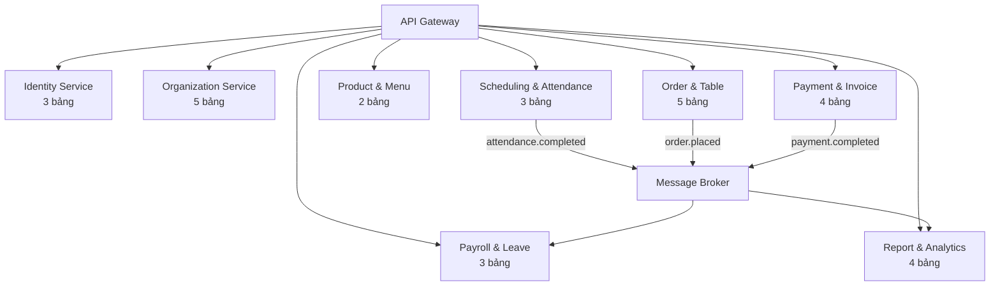
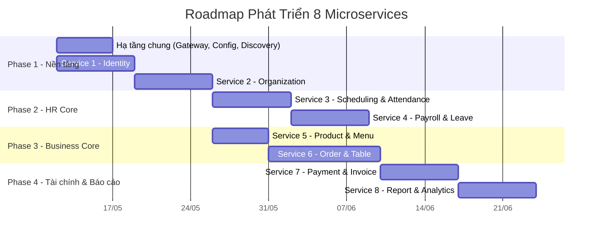

# Phân Tích Sơ Đồ CSDL & Đề Xuất Chia Microservice - Operra F&B

## 1. Danh Sách Đầy Đủ 29 Bảng

| # | Tên Bảng | Trường chính | FK → |
|---|----------|-------------|------|
| 1 | **UserAccount** | UniqueID, username, password, email, Status, creation_day | — |
| 2 | **Role** | UniqueID, name, description | — |
| 3 | **Permission** | UniqueID, name, description | — |
| 4 | **Company** | UniqueID, name, tax_code | — |
| 5 | **Branch** | UniqueID, company_id, name, address, phone, status | → Company |
| 6 | **Department** | UniqueID, name, description | — |
| 7 | **Position** | UniqueID, name, description, level, base_salary | — |
| 8 | **Employee** | UniqueID, department_id, position_id, branch_id, fullname, dob, phone_number, hire_day, status | → Dept, Position, Branch |
| 9 | **WorkAssignment** | UniqueID, name, start_time, end_time, break_time, shift_type | — |
| 10 | **ShiftAssignment** | UniqueID, employee_id, work_assign_id, date, assigned_by | → Employee, WorkAssignment |
| 11 | **Attendance** | UniqueID, check_in_time, check_out_time, method, location, status | → Employee |
| 12 | **Payroll** | UniqueID, month, year, total_working_hour, gross_salary, net_salary, deductions | → Employee |
| 13 | **LeaveRequest** | UniqueID, from_date, to_date, reason, approve_status | → Employee |
| 14 | **EmployeePerformance** | UniqueID, employee_id, date, orders_count, revenue, avg_order_value, attendance_score | → Employee |
| 15 | **ServiceArea** | UniqueID, name, branch_id, status | → Branch |
| 16 | **Table** | UniqueID, name, area_id, capacity, status | → ServiceArea |
| 17 | **ProductCategory** | UniqueID, name, description | — |
| 18 | **Product** | UniqueID, name, category_id, price, stock_keeping_unit, status | → ProductCategory |
| 19 | **Order** | UniqueID, cash_session_id, employee_id, order_no, order_time, status, total_price, note | → CashSession, Employee |
| 20 | **OrderItem** | UniqueID, quantity, price, discount, note, order_id, product_id | → Order, Product |
| 21 | **CashSession** | UniqueID, employee_id, shift_assignment_id, open_time, close_time, opening_cash, closing_cash, difference_amount | → Employee, ShiftAssignment |
| 22 | **Expense** | UniqueID, cash_session_id, type, amount, description, expense_time | → CashSession |
| 23 | **Invoice** | UniqueID, invoice_no, issued_time, order_id, customer_name, customer_tax_code, total_amount, tax_amount, final_amount, invoice_status | → Order |
| 24 | **InvoiceItem** | UniqueID, invoice_id, name, price, total_amount, quantity, tax_rate, product_id | → Invoice, Product |
| 25 | **Payment** | UniqueID, method, paid_amount, paid_time, payment_status, order_id | → Order |
| 26 | **Report** | UniqueID, type, title, branch_id, generated_by, fromDate, toDate, generatedAt, format, status, fileUrl | → Branch, Employee |
| 27 | **RevenueReport** | UniqueID, report_id, branch_id, reportDate, shiftType, totalOrders, totalDiscount, netRevenue, cashRevenue, cardRevenue, cancelledOrders, avgOrderValue | → Report, Branch |
| 28 | **LaborCostReport** | UniqueID, report_id, branch_id, reportDate, totalEmployees, totalWorkingHours, totalGrossSalary, totalDeductions, totalNetSalary, overtimeCost, allowanceCost, unpaidLeaveDeduction | → Report, Branch |
| 29 | **ProfitAnalysis** | UniqueID, report_id, branch_id, fromDate, toDate, totalRevenue, operatingExpense, laborCost, taxCost, grossProfit, netProfit, profitMargin | → Report, Branch |

---

## 2. Đề Xuất Chia Thành 8 Microservice

### 🔐 Service 1: **Identity Service** (3 bảng)
> `UserAccount`, `Role`, `Permission`

**Tại sao?**
- Xác thực & phân quyền là **cross-cutting concern** — mọi service đều cần
- Cần bảo mật tập trung (OAuth2/JWT), scale riêng khi traffic login cao
- Logic ít thay đổi, deploy độc lập

---

### 🏢 Service 2: **Organization Service** (5 bảng)
> `Company`, `Branch`, `Department`, `Position`, `Employee`

**Tại sao?**
- Bounded context "Cơ cấu tổ chức" rõ ràng: Company → Branch → Department/Position → Employee
- Là **Source of Truth** cho thông tin nhân viên — các service khác chỉ lưu `employee_id`
- Dữ liệu ổn định, ít thay đổi

---

### ⏰ Service 3: **Scheduling & Attendance Service** (3 bảng)
> `WorkAssignment`, `ShiftAssignment`, `Attendance`

**Tại sao?**
- Tần suất truy cập cao (chấm công hàng ngày), cần scale riêng
- Attendance có thể tích hợp QR/GPS/Face ID → xử lý riêng
- Data volume tăng nhanh → cần partitioning/archiving riêng

---

### 💰 Service 4: **Payroll & Leave Service** (3 bảng)
> `Payroll`, `LeaveRequest`, `EmployeePerformance`

**Tại sao?**
- Dữ liệu lương **nhạy cảm**, cần security policy riêng
- Payroll tính theo batch (cuối tháng), consume data từ Attendance + Position
- EmployeePerformance tổng hợp KPI → cùng domain đánh giá nhân sự
- LeaveRequest ảnh hưởng trực tiếp đến tính lương

---

### 🍕 Service 5: **Product & Menu Service** (2 bảng)
> `ProductCategory`, `Product`

**Tại sao?**
- Domain F&B riêng biệt, hoàn toàn tách khỏi HR
- Menu thay đổi thường xuyên → deploy độc lập
- Cache hiệu quả, phục vụ nhiều kênh (POS, app, web)

---

### 🛒 Service 6: **Order & Table Service** (5 bảng)
> `ServiceArea`, `Table`, `Order`, `OrderItem`, `CashSession`

**Tại sao?**
- **Core business** của F&B — tần suất giao dịch cao nhất
- Order + OrderItem cần ACID transaction → phải cùng service
- CashSession gắn chặt với ca bán hàng và Order
- Table + ServiceArea quản lý trạng thái bàn real-time (WebSocket)

---

### 💳 Service 7: **Payment & Invoice Service** (4 bảng)
> `Payment`, `Invoice`, `InvoiceItem`, `Expense`

**Tại sao?**
- Tài chính/kế toán cần **audit trail** riêng, tuân thủ pháp luật thuế
- Invoice liên quan đến xuất hóa đơn điện tử (VAT) → tích hợp bên thứ 3
- Payment hỗ trợ nhiều phương thức (tiền mặt, thẻ, ví điện tử) → logic phức tạp riêng
- Expense (chi phí trong ca) gắn với quản lý tài chính

---

### 📊 Service 8: **Report & Analytics Service** (4 bảng)
> `Report`, `RevenueReport`, `LaborCostReport`, `ProfitAnalysis`

**Tại sao?**
- Reporting là **read-heavy**, không cần write transaction → tối ưu riêng (CQRS)
- Tổng hợp dữ liệu từ nhiều service khác → consume events async
- Có thể dùng database riêng tối ưu cho query (ClickHouse, TimescaleDB)
- Không ảnh hưởng đến hiệu suất các service giao dịch chính

---

## 3. Kiến Trúc Tổng Quan



## 4. Giao Tiếp Giữa Các Service

| Từ Service | → Đến Service | Kiểu | Mô tả |
|------------|--------------|------|--------|
| Order | Product | Sync (REST) | Lấy giá sản phẩm khi tạo order |
| Order | Payment & Invoice | Event | Khi order hoàn thành → tạo payment |
| Attendance | Payroll | Event | Tổng giờ làm → tính lương |
| Order | Report | Event | Dữ liệu doanh thu → báo cáo |
| Payroll | Report | Event | Chi phí lao động → báo cáo |
| All | Identity | Sync (JWT) | Verify token mỗi request |

## 5. Tóm Tắt

| Service | Bảng | Tech đề xuất |
|---------|------|-------------|
| 🔐 Identity | 3 | Spring Security + OAuth2 |
| 🏢 Organization | 5 | Spring Boot + JPA |
| ⏰ Scheduling | 3 | Spring Boot + Redis |
| 💰 Payroll | 3 | Spring Boot + Batch |
| 🍕 Product | 2 | Spring Boot + Redis Cache |
| 🛒 Order | 5 | Spring Boot + WebSocket |
| 💳 Payment | 4 | Spring Boot + Integration |
| 📊 Report | 4 | Spring Boot + CQRS |

> **Tổng: 29 bảng → 8 microservices**

---

# Kế Hoạch Phát Triển Chi Tiết Từng Service

## 6. Thứ Tự Phát Triển (Dependency Order)



> [!IMPORTANT]
> **Phải phát triển theo thứ tự**: Identity → Organization → (Scheduling + Product song song) → Order → Payment → Report. Vì các service sau phụ thuộc vào service trước.

---

## Phase 0: Hạ tầng Chung (Trước khi bắt đầu service nào)

### Cần tạo trước

| Thành phần | Công nghệ | Mô tả |
|------------|-----------|-------|
| **Parent POM** | Maven | Quản lý version chung cho tất cả services |
| **API Gateway** | Spring Cloud Gateway | Entry point, routing, rate limiting |
| **Config Server** | Spring Cloud Config | Quản lý config tập trung (Git-backed) |
| **Service Discovery** | Eureka Server | Đăng ký & tìm kiếm service |
| **Message Broker** | RabbitMQ hoặc Kafka | Giao tiếp async giữa services |
| **Common Library** | Java Library | DTO chung, exception handling, security filter |

### Cấu trúc project

```
operra-microservices/
├── operra-parent/                 # Parent POM
├── operra-common/                 # Shared DTOs, utils, exceptions
├── operra-gateway/                # API Gateway
├── operra-config-server/          # Config Server
├── operra-discovery-server/       # Eureka
├── operra-identity-service/       # Service 1
├── operra-organization-service/   # Service 2
├── operra-scheduling-service/     # Service 3
├── operra-payroll-service/        # Service 4
├── operra-product-service/        # Service 5
├── operra-order-service/          # Service 6
├── operra-payment-service/        # Service 7
├── operra-report-service/         # Service 8
└── docker-compose.yml             # Local dev environment
```

---

## 🔐 Service 1: Identity Service

### Bảng: `UserAccount`, `Role`, `Permission`

### Tasks chi tiết

```
Phase 1.1 - Setup & Entities
├── [ ] Khởi tạo Spring Boot project (Web, JPA, Security, OAuth2)
├── [ ] Tạo Entity: UserAccount, Role, Permission
├── [ ] Tạo bảng join: user_roles, role_permissions (Many-to-Many)
├── [ ] Cấu hình database riêng (identity_db)
├── [ ] Migration script (Flyway/Liquibase)
│
Phase 1.2 - Authentication
├── [ ] POST /api/auth/register - Đăng ký tài khoản
├── [ ] POST /api/auth/login - Đăng nhập, trả về JWT
├── [ ] POST /api/auth/refresh - Refresh token
├── [ ] POST /api/auth/logout - Vô hiệu hóa token
├── [ ] JWT Token Provider (access token + refresh token)
├── [ ] Password encoder (BCrypt)
│
Phase 1.3 - Authorization & RBAC
├── [ ] CRUD /api/roles - Quản lý Role
├── [ ] CRUD /api/permissions - Quản lý Permission
├── [ ] PUT /api/users/{id}/roles - Gán role cho user
├── [ ] PUT /api/roles/{id}/permissions - Gán permission cho role
├── [ ] GET /api/auth/me - Lấy thông tin user hiện tại
│
Phase 1.4 - Internal APIs
├── [ ] GET /api/internal/users/{id} - Lấy user info (cho service khác gọi)
├── [ ] GET /api/internal/validate-token - Validate JWT token
├── [ ] Event: user.created, user.status-changed (publish to MQ)
│
Phase 1.5 - Testing & Security
├── [ ] Unit tests cho JWT, AuthService
├── [ ] Integration tests cho login flow
├── [ ] Rate limiting cho login endpoint
└── [ ] Account lockout sau N lần sai password
```

### Dependencies: Không phụ thuộc service nào

---

## 🏢 Service 2: Organization Service

### Bảng: `Company`, `Branch`, `Department`, `Position`, `Employee`

### Tasks chi tiết

```
Phase 2.1 - Setup & Entities
├── [ ] Khởi tạo Spring Boot project
├── [ ] Tạo Entity: Company, Branch, Department, Position, Employee
├── [ ] Quan hệ: Company 1-N Branch, Branch 1-N Employee
├── [ ] Quan hệ: Department 1-N Employee, Position 1-N Employee
├── [ ] Cấu hình database riêng (organization_db)
├── [ ] Migration scripts
│
Phase 2.2 - Company & Branch APIs
├── [ ] CRUD /api/companies
├── [ ] CRUD /api/companies/{companyId}/branches
├── [ ] GET /api/branches?status=ACTIVE - Lọc chi nhánh
├── [ ] PUT /api/branches/{id}/status - Kích hoạt/vô hiệu hóa
│
Phase 2.3 - Department & Position APIs
├── [ ] CRUD /api/departments
├── [ ] CRUD /api/positions
├── [ ] GET /api/positions?level=MANAGER - Lọc theo cấp bậc
│
Phase 2.4 - Employee APIs (Core)
├── [ ] POST /api/employees - Tạo nhân viên mới
│   └── Gọi Identity Service tạo UserAccount tương ứng (Saga)
├── [ ] GET /api/employees - Danh sách (phân trang, filter)
├── [ ] GET /api/employees/{id} - Chi tiết nhân viên
├── [ ] PUT /api/employees/{id} - Cập nhật thông tin
├── [ ] PUT /api/employees/{id}/status - Thay đổi trạng thái
├── [ ] GET /api/employees/branch/{branchId} - NV theo chi nhánh
├── [ ] GET /api/employees/department/{deptId} - NV theo phòng ban
│
Phase 2.5 - Events & Internal APIs
├── [ ] Event: employee.created, employee.updated, employee.deactivated
├── [ ] GET /api/internal/employees/{id} - Internal API cho service khác
├── [ ] GET /api/internal/employees/branch/{branchId}/count
│
Phase 2.6 - Testing
├── [ ] Unit tests
├── [ ] Integration tests
└── [ ] Test Saga: tạo Employee + UserAccount
```

### Dependencies: → Identity Service (tạo UserAccount khi tạo Employee)

---

## ⏰ Service 3: Scheduling & Attendance Service

### Bảng: `WorkAssignment`, `ShiftAssignment`, `Attendance`

### Tasks chi tiết

```
Phase 3.1 - Setup & Entities
├── [ ] Khởi tạo Spring Boot project
├── [ ] Tạo Entity: WorkAssignment, ShiftAssignment, Attendance
├── [ ] ShiftAssignment FK → employee_id, work_assign_id, assigned_by
├── [ ] Cấu hình database riêng (scheduling_db)
│
Phase 3.2 - Work Assignment APIs (Ca làm việc)
├── [ ] CRUD /api/work-assignments
├── [ ] GET /api/work-assignments?shiftType=MORNING
├── [ ] Validate: end_time > start_time, break_time hợp lệ
│
Phase 3.3 - Shift Assignment APIs (Phân ca)
├── [ ] POST /api/shift-assignments - Phân ca cho nhân viên
├── [ ] POST /api/shift-assignments/bulk - Phân ca hàng loạt (cả tuần)
├── [ ] GET /api/shift-assignments?employeeId=X&fromDate=Y&toDate=Z
├── [ ] GET /api/shift-assignments/branch/{branchId}/date/{date}
├── [ ] PUT /api/shift-assignments/{id} - Đổi ca
├── [ ] DELETE /api/shift-assignments/{id} - Hủy ca
├── [ ] Validate: không trùng ca, employee đang active
│
Phase 3.4 - Attendance APIs (Chấm công)
├── [ ] POST /api/attendance/check-in - Chấm công vào
│   └── Validate: có ShiftAssignment cho ngày hôm nay
│   └── Ghi nhận method (QR, GPS, Manual), location
├── [ ] POST /api/attendance/check-out - Chấm công ra
├── [ ] GET /api/attendance?employeeId=X&month=5&year=2026
├── [ ] GET /api/attendance/summary?employeeId=X&month=5 - Tổng hợp giờ
├── [ ] PUT /api/attendance/{id}/status - Admin chỉnh sửa trạng thái
│
Phase 3.5 - Events
├── [ ] Event: attendance.checked-in, attendance.checked-out
├── [ ] Event: attendance.monthly-summary (cuối tháng)
│   └── Payroll Service consume để tính lương
│
Phase 3.6 - Testing
├── [ ] Test check-in/check-out flow
├── [ ] Test phân ca hàng loạt
└── [ ] Test tính tổng giờ làm
```

### Dependencies: → Organization Service (validate employee_id)

---

## 💰 Service 4: Payroll & Leave Service

### Bảng: `Payroll`, `LeaveRequest`, `EmployeePerformance`

### Tasks chi tiết

```
Phase 4.1 - Setup & Entities
├── [ ] Khởi tạo Spring Boot project
├── [ ] Tạo Entity: Payroll, LeaveRequest, EmployeePerformance
├── [ ] Cấu hình database riêng (payroll_db)
│
Phase 4.2 - Leave Request APIs
├── [ ] POST /api/leave-requests - Tạo đơn nghỉ phép
├── [ ] GET /api/leave-requests?employeeId=X&status=PENDING
├── [ ] PUT /api/leave-requests/{id}/approve - Duyệt đơn
├── [ ] PUT /api/leave-requests/{id}/reject - Từ chối đơn
├── [ ] GET /api/leave-requests/balance?employeeId=X - Số ngày phép còn
├── [ ] Validate: không trùng ngày, còn phép
│
Phase 4.3 - Payroll APIs
├── [ ] POST /api/payroll/calculate?month=5&year=2026 - Tính lương tháng
│   └── Consume: attendance summary từ Scheduling Service
│   └── Consume: base_salary từ Organization Service (Position)
│   └── Consume: leave days từ LeaveRequest
│   └── Tính: gross_salary, deductions, net_salary
├── [ ] GET /api/payroll?month=5&year=2026 - Bảng lương tháng
├── [ ] GET /api/payroll/employee/{id}?year=2026 - Lương NV cả năm
├── [ ] PUT /api/payroll/{id}/confirm - Xác nhận bảng lương
│
Phase 4.4 - Employee Performance APIs
├── [ ] POST /api/performance/calculate?employeeId=X&date=Y
│   └── Tổng hợp: orders_count, revenue từ Order Service
│   └── Tổng hợp: attendance_score từ Scheduling Service
├── [ ] GET /api/performance?employeeId=X&fromDate=Y&toDate=Z
├── [ ] GET /api/performance/ranking?branchId=X&month=5
│
Phase 4.5 - Events & Batch Jobs
├── [ ] Consumer: attendance.monthly-summary → trigger tính lương
├── [ ] Consumer: order.completed → cập nhật performance
├── [ ] Scheduled Job: tính performance hàng ngày
├── [ ] Event: payroll.calculated → Report Service
│
Phase 4.6 - Testing
├── [ ] Test tính lương với các case: đủ công, thiếu công, có OT
├── [ ] Test approve/reject leave
└── [ ] Test performance calculation
```

### Dependencies: → Organization, Scheduling, Order Service

---

## 🍕 Service 5: Product & Menu Service

### Bảng: `ProductCategory`, `Product`

### Tasks chi tiết

```
Phase 5.1 - Setup & Entities
├── [ ] Khởi tạo Spring Boot project
├── [ ] Tạo Entity: ProductCategory, Product
├── [ ] Product FK → category_id
├── [ ] Cấu hình database riêng (product_db)
│
Phase 5.2 - Category APIs
├── [ ] CRUD /api/categories
├── [ ] GET /api/categories?includeProducts=true
│
Phase 5.3 - Product APIs
├── [ ] CRUD /api/products
├── [ ] GET /api/products?categoryId=X&status=ACTIVE
├── [ ] GET /api/products/search?keyword=coffee
├── [ ] PUT /api/products/{id}/status - Ngừng bán / kích hoạt
├── [ ] PUT /api/products/{id}/price - Cập nhật giá
├── [ ] GET /api/products/menu - Menu đầy đủ (grouped by category)
│
Phase 5.4 - Internal APIs & Cache
├── [ ] GET /api/internal/products/{id} - Cho Order Service gọi
├── [ ] GET /api/internal/products/batch?ids=1,2,3 - Lấy nhiều SP
├── [ ] Redis Cache cho menu (invalidate khi update)
├── [ ] Event: product.updated, product.created
│
Phase 5.5 - Testing
├── [ ] Unit tests
├── [ ] Test cache invalidation
└── [ ] Test search functionality
```

### Dependencies: Không phụ thuộc (chỉ cần Identity để xác thực)

---

## 🛒 Service 6: Order & Table Service

### Bảng: `ServiceArea`, `Table`, `Order`, `OrderItem`, `CashSession`

### Tasks chi tiết

```
Phase 6.1 - Setup & Entities
├── [ ] Khởi tạo Spring Boot project
├── [ ] Tạo Entity: ServiceArea, Table, Order, OrderItem, CashSession
├── [ ] Quan hệ: ServiceArea 1-N Table, Order 1-N OrderItem
├── [ ] CashSession FK → employee_id, shift_assignment_id
├── [ ] Order FK → cash_session_id, employee_id
├── [ ] Cấu hình database riêng (order_db)
│
Phase 6.2 - Service Area & Table APIs
├── [ ] CRUD /api/service-areas
├── [ ] CRUD /api/tables
├── [ ] GET /api/tables?areaId=X&status=AVAILABLE
├── [ ] PUT /api/tables/{id}/status - Đổi trạng thái bàn
├── [ ] WebSocket /ws/tables - Real-time trạng thái bàn
│
Phase 6.3 - Cash Session APIs (Ca tiền)
├── [ ] POST /api/cash-sessions/open - Mở ca
│   └── Ghi nhận: employee_id, shift_assignment_id, opening_cash
├── [ ] PUT /api/cash-sessions/{id}/close - Đóng ca
│   └── Tính: closing_cash, difference_amount
├── [ ] GET /api/cash-sessions/current?employeeId=X
├── [ ] GET /api/cash-sessions?date=2026-05-10&branchId=X
│
Phase 6.4 - Order APIs (Core)
├── [ ] POST /api/orders - Tạo đơn hàng mới
│   └── Validate: table available, cash_session open
│   └── Gọi Product Service lấy giá
│   └── Tạo Order + OrderItems trong 1 transaction
│   └── Cập nhật Table status → OCCUPIED
├── [ ] GET /api/orders/{id} - Chi tiết đơn
├── [ ] GET /api/orders?status=PENDING&branchId=X
├── [ ] PUT /api/orders/{id}/items - Thêm/sửa món
├── [ ] PUT /api/orders/{id}/status - Chuyển trạng thái
│   └── PENDING → CONFIRMED → PREPARING → SERVED → COMPLETED
├── [ ] POST /api/orders/{id}/cancel - Hủy đơn
├── [ ] GET /api/orders/table/{tableId}/active - Đơn hiện tại của bàn
│
Phase 6.5 - Events
├── [ ] Event: order.created, order.completed, order.cancelled
├── [ ] Event: cash-session.closed (→ Report Service)
├── [ ] Consumer: payment.completed → update order status
│
Phase 6.6 - Real-time & Testing
├── [ ] WebSocket: cập nhật trạng thái order real-time (cho bếp)
├── [ ] Test order lifecycle flow
├── [ ] Test concurrent orders trên cùng bàn
└── [ ] Test cash session open/close
```

### Dependencies: → Organization, Scheduling, Product Service

---

## 💳 Service 7: Payment & Invoice Service

### Bảng: `Payment`, `Invoice`, `InvoiceItem`, `Expense`

### Tasks chi tiết

```
Phase 7.1 - Setup & Entities
├── [ ] Khởi tạo Spring Boot project
├── [ ] Tạo Entity: Payment, Invoice, InvoiceItem, Expense
├── [ ] Payment FK → order_id
├── [ ] Invoice FK → order_id, Invoice 1-N InvoiceItem
├── [ ] Expense FK → cash_session_id
├── [ ] Cấu hình database riêng (payment_db)
│
Phase 7.2 - Payment APIs
├── [ ] POST /api/payments - Thanh toán đơn hàng
│   └── Gọi Order Service lấy total_amount
│   └── Hỗ trợ: CASH, CARD, E_WALLET, TRANSFER
│   └── Validate: paid_amount >= total_amount
├── [ ] GET /api/payments?orderId=X
├── [ ] GET /api/payments/daily?date=2026-05-10&branchId=X
├── [ ] PUT /api/payments/{id}/refund - Hoàn tiền
│
Phase 7.3 - Invoice APIs (Hóa đơn)
├── [ ] POST /api/invoices - Xuất hóa đơn
│   └── Tự sinh invoice_no (theo quy tắc)
│   └── Tạo InvoiceItems từ OrderItems
│   └── Tính tax_amount, final_amount
├── [ ] GET /api/invoices/{id}
├── [ ] GET /api/invoices?fromDate=X&toDate=Y
├── [ ] GET /api/invoices/{id}/pdf - Xuất PDF
├── [ ] POST /api/invoices/{id}/e-invoice - Xuất hóa đơn điện tử
│   └── Tích hợp nhà cung cấp HDDT (VNPT, Viettel, FPT)
│
Phase 7.4 - Expense APIs (Chi phí trong ca)
├── [ ] POST /api/expenses - Ghi nhận chi phí
│   └── Type: INGREDIENT, REPAIR, UTILITIES, OTHER
├── [ ] GET /api/expenses?cashSessionId=X
├── [ ] GET /api/expenses/summary?branchId=X&month=5
│
Phase 7.5 - Events
├── [ ] Event: payment.completed → Order Service (cập nhật status)
├── [ ] Event: invoice.issued → Report Service
├── [ ] Consumer: order.completed → auto-generate invoice (nếu cấu hình)
│
Phase 7.6 - Testing
├── [ ] Test payment flow (đủ tiền, thiếu tiền, hoàn tiền)
├── [ ] Test xuất hóa đơn + tính thuế
└── [ ] Test expense tracking
```

### Dependencies: → Order Service

---

## 📊 Service 8: Report & Analytics Service

### Bảng: `Report`, `RevenueReport`, `LaborCostReport`, `ProfitAnalysis`

### Tasks chi tiết

```
Phase 8.1 - Setup & Entities
├── [ ] Khởi tạo Spring Boot project
├── [ ] Tạo Entity: Report, RevenueReport, LaborCostReport, ProfitAnalysis
├── [ ] RevenueReport, LaborCostReport, ProfitAnalysis FK → report_id, branch_id
├── [ ] Cấu hình database riêng (report_db) - tối ưu read
│
Phase 8.2 - Report Framework
├── [ ] POST /api/reports - Tạo báo cáo mới (trigger generation)
│   └── type: REVENUE, LABOR_COST, PROFIT
│   └── Async processing (trả về report_id, status=GENERATING)
├── [ ] GET /api/reports/{id} - Lấy báo cáo
├── [ ] GET /api/reports?type=REVENUE&branchId=X&fromDate=Y&toDate=Z
├── [ ] GET /api/reports/{id}/download?format=PDF|EXCEL
├── [ ] DELETE /api/reports/{id}
│
Phase 8.3 - Revenue Report
├── [ ] Consumer: order.completed, payment.completed events
├── [ ] Aggregate: totalOrders, totalDiscount, netRevenue
├── [ ] Aggregate: cashRevenue, cardRevenue (theo phương thức TT)
├── [ ] Aggregate: cancelledOrders, avgOrderValue
├── [ ] GET /api/reports/revenue/daily?branchId=X&date=Y
├── [ ] GET /api/reports/revenue/monthly?branchId=X&month=5&year=2026
│
Phase 8.4 - Labor Cost Report
├── [ ] Consumer: payroll.calculated events
├── [ ] Aggregate: totalEmployees, totalWorkingHours
├── [ ] Aggregate: totalGrossSalary, totalDeductions, totalNetSalary
├── [ ] Aggregate: overtimeCost, allowanceCost
├── [ ] GET /api/reports/labor-cost?branchId=X&month=5&year=2026
│
Phase 8.5 - Profit Analysis
├── [ ] Combine: Revenue data + Labor Cost + Expenses
├── [ ] Calculate: grossProfit, netProfit, profitMargin
├── [ ] GET /api/reports/profit?branchId=X&fromDate=Y&toDate=Z
├── [ ] GET /api/reports/profit/trend?branchId=X&months=6
│
Phase 8.6 - Export & Scheduling
├── [ ] Export PDF (JasperReports hoặc iText)
├── [ ] Export Excel (Apache POI)
├── [ ] Scheduled Job: tự động tạo báo cáo ngày/tuần/tháng
├── [ ] Email notification khi báo cáo sẵn sàng
│
Phase 8.7 - Testing
├── [ ] Test report generation pipeline
├── [ ] Test data aggregation accuracy
└── [ ] Test export PDF/Excel
```

### Dependencies: → Tất cả service (consume events)

---

## Tổng Kết Thứ Tự Ưu Tiên

| Ưu tiên | Service | Lý do |
|---------|---------|-------|
| 🥇 P0 | Hạ tầng (Gateway, Config, Eureka) | Nền tảng bắt buộc |
| 🥇 P0 | Identity Service | Mọi service cần xác thực |
| 🥈 P1 | Organization Service | Source of Truth cho Employee |
| 🥈 P1 | Product & Menu Service | Có thể phát triển song song với Org |
| 🥉 P2 | Scheduling & Attendance | Cần Employee data |
| 🥉 P2 | Order & Table Service | Cần Product + Employee |
| 🏅 P3 | Payroll & Leave | Cần Attendance data |
| 🏅 P3 | Payment & Invoice | Cần Order data |
| 🏅 P4 | Report & Analytics | Cần data từ tất cả |
